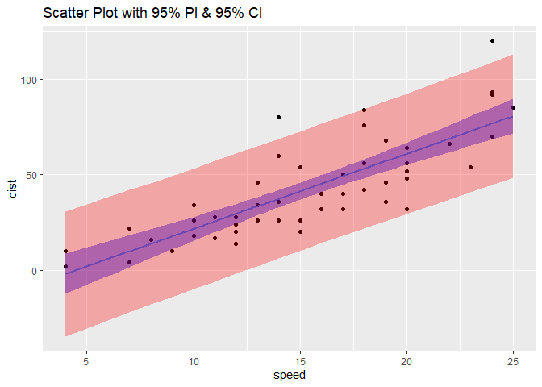

Programming Background
================
Jiyue Zhang
2022-06-07

# Response of the prompt

-   I think R is more flexible and versatile than SAS, and secondly, R
    is an open source software and it is free. And sas, it is not an
    open source software, we need to buy the license to use SAS. But I
    think SAS is more systematic compared to R. Many of the questions
    about using sas can be answered on the official website.
-   I like the flexibility of R, especially the ability to create your
    own functions.
-   Although I like the flexibility of R, I miss the systemic nature of
    SAS. It is the flexibility of R that creates many functions that can
    achieve the same purpose which makes me confused sometimes.
-   I don’t think it’s difficult to learn R, it’s a easy language to get
    started with, but if you want to become an expert with this
    software, it’s still a bit difficult.

# example R Markdown output

``` r
plot(iris)
```

<!-- -->
